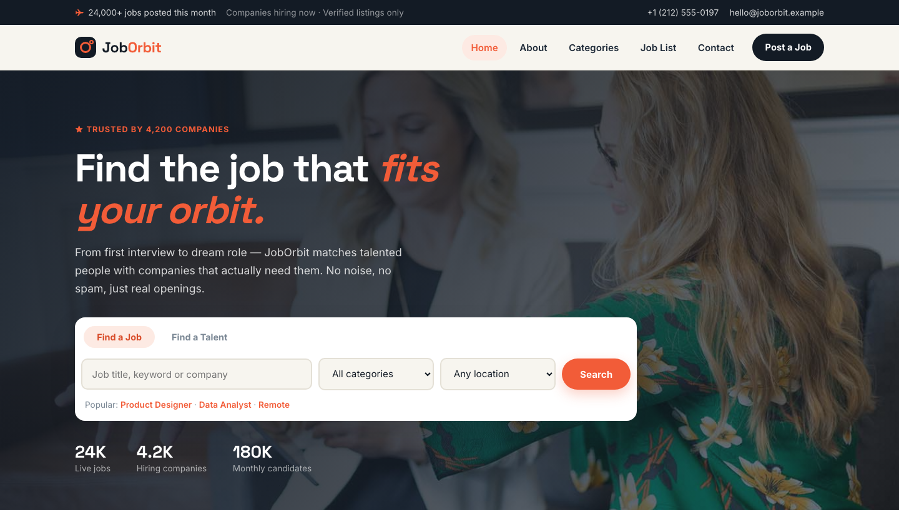

# JobOrbit — Modern Job Portal Template

A premium, framework-free HTML template for a modern job portal. Warm paper grounds with deep slate ink, persimmon orange and teal accents, driven by Space Grotesk display type and Inter body text — a confident, transparent presence for a platform connecting candidates with hiring companies.

## 📸 Screenshot

## Design System

| Token | Value |
|-------|-------|
| **Ground** | `--clr-paper` `#f7f5ef` (warm), `--clr-dark` `#131b25` (ink) |
| **Primary** | `--clr-flame` `#f25c38` (persimmon) |
| **Secondary** | `--clr-teal` `#1e7d6e` |
| **Surface** | `--clr-card` `#ffffff`, `--clr-mist` `#efece3`, `--clr-line` `#e4e0d6` |
| **Text** | `--clr-ink` `#131b25`, `--clr-body` `#465464`, `--clr-muted` `#7a8794` |
| **Display type** | `Space Grotesk` (400–700) |
| **Body type** | `Inter` (400–800) |
| **Container** | 1200px max-width, centered |
| **Breakpoints** | ~1100px, ~992px, ~768px, ~576px |

## Pages

| Page | File | Description |
|------|------|-------------|
| Home | [index.html](index.html) | Crossfading hero with dual-tab search (job/talent), hero stats, category ribbon, how-it-works steps, featured job cards, hiring split, testimonials, CTA |
| About | [about.html](about.html) | Company story since 2019, stats band, three values |
| Categories | [category.html](category.html) | Twelve industry category cards with opening counts |
| Job List | [job-list.html](job-list.html) | Filter bar plus twelve verified job listings with logos and salary ranges |
| Contact | [contact.html](contact.html) | `[data-form]` contact form with subject select, info list, map frame |
| 404 | [404.html](404.html) | On-brand error page with recovery links |

## Features

- **Framework-free** — pure HTML5, CSS3 (custom properties, Grid, Flexbox, `clamp()`), vanilla JavaScript
- **Recruitment editorial aesthetic** — warm paper + ink + persimmon, dual-accent tag system
- **Fluid responsive** — four breakpoints, no horizontal scroll on any viewport
- **Scroll reveal** — IntersectionObserver-powered `.reveal` animations (respects `prefers-reduced-motion`)
- **Mobile nav** — burger toggle with `aria-expanded` accessible pattern
- **Hero crossfade** — automatic 6s background image transition via `.hero-bg img` + `.active`
- **Dual-tab search card** — Find a Job / Find a Talent toggle with keyword, category and location fields
- **Hero stats strip** — live jobs, hiring companies, monthly candidates
- **Category ribbon** — eight clickable category chips with vacancy counts
- **Step cards** — three-numbered "how it works" process
- **Job cards** — company logo, role, type/location tags, transparent salary and apply button
- **Filter bar** — type/category/location selects with result count
- **Testimonial cards** — avatar, name, role and quote
- **Contact form** — `[data-form]` hook with `.form-ok` / `.form-err` / `.show` toggle
- **Newsletter** — footer sign-up form with validation feedback
- **Original imagery** — office, team and corporate photography, no placeholders

## Tech Stack

- HTML5 + CSS3 (W3C-valid, semantic landmarks)
- Vanilla JavaScript (canonical IIFE build)
- Google Fonts (Space Grotesk + Inter)
- SVG favicon (inline data: URI)

## SEO

- Semantic HTML5 structure (`<header>`, `<nav>`, `<main>`, `<section>`, `<footer>`)
- Unique `<title>` and `<meta description>` per page
- `lang="en"` attribute, `charset="utf-8"`, viewport meta
- Alt text on all images

## License

Free for personal and commercial use. Attribution appreciated but not required.

---

## Let's Build Something Together 🚀

[Book a free consultation](https://tally.so/r/q4q1L9)
